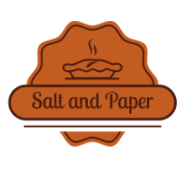
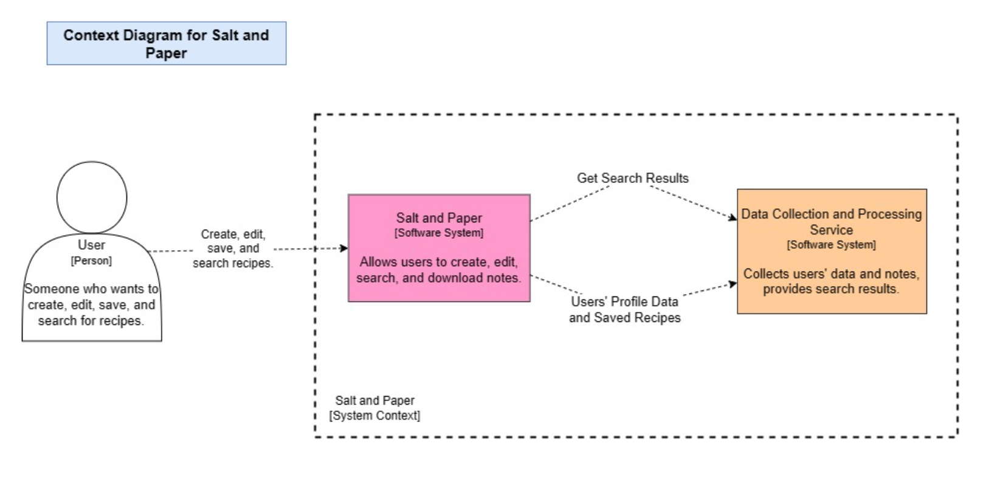
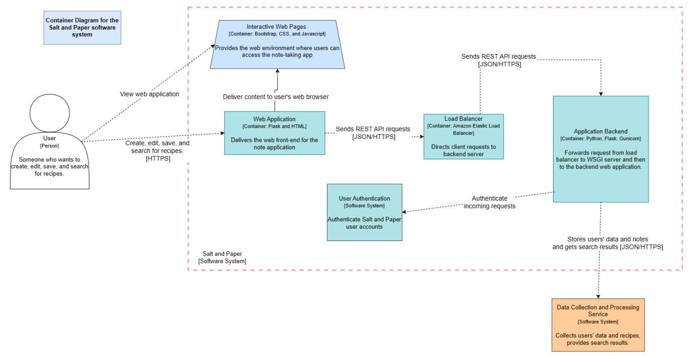
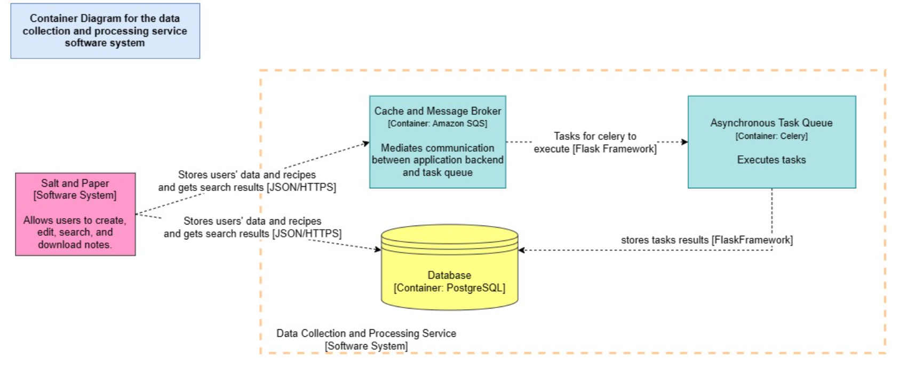
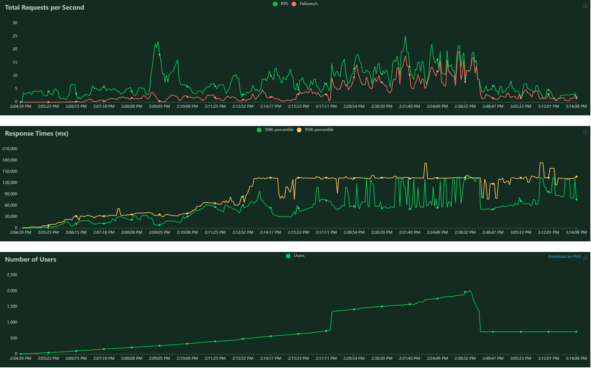
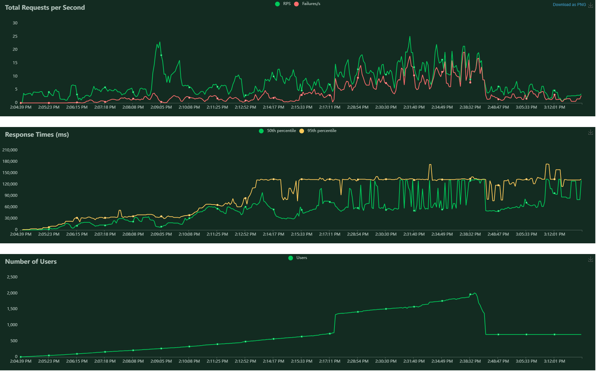

# Salt and Paper: Software Architecture Capstone Project Report

## Demonstration

[Demo](https://saltandpaper-lb-1821943437.us-east-1.elb.amazonaws.com/api/v1/home)

## Abstract

Introducing Salt & Paper, an innovative application designed to create a global community for cooking enthusiasts. This platform not only provides a space for users to post, save, search, and share recipes, but also encourages engagement, discovery, and culinary creativity. With a robust architecture that ensures scalability and availability, Salt & Paper is geared to handle a large userbase, providing a seamless experience for users regardless of peak usage times.

The platform features an inclusive browser version that allows users to utilize the application with ease. The inclusion of both authenticated and guest user modes ensures the application caters to the needs of users at different engagement levels. Users can effortlessly search for recipes using either keywords or tags, allowing for a wide array of results tailored to their specific requirements.

Additionally, Salt & Paper offers a feature to create and edit recipes, complete with title, description, images, and tags, thereby nurturing the users' creativity. With visibility settings that can be toggled between 'public' and 'only me,' users can have full control over their shared content.

Moreover, the application includes a personalized cookbook feature for users to save their favorite recipes, fostering a custom and organized recipe collection. With the integration of a personal recipe recommendation system, the application can suggest recipes based on user's preferences, creating an intuitive and personalized culinary journey.

In the spirit of continual improvement, Salt & Paper is able to receive regular updates introducing new features, thus extending its functionality to better serve its users. By connecting cooking lovers worldwide and fostering a dynamic space for recipe sharing and discovery, Salt & Paper aims to stir up a culinary revolution.

## Changes

Several features have been excluded as they are not considered essential to the main features of the application. These features include the option to add images in recipe posts, the visibility settings for the recipe posts, and the personalised recommendation system.

From an architecture perspective, we initially decided to design the application using microservices for each of the collection of endpoints, such as recipe endpoints, cookbook endpoints, among others. This was to improve its scalability and extensibility. However, due to the high amount of communication needed between services, this approach did not seem suitable as it would make the application complex, while not necessarily making the database operations faster, and since the application is still in its early stages and do not have a large user base yet, this approach is not needed yet.

## Architecture

### Context

  

  

### Container

  

  

  

### Dynamic

  

The Minimum Viable Product (MVP) showcases a tantalizing software architecture, composed of components:

1. Frontend:

   - User Interface (UI): Crafted with cutting-edge React frameworks, the UI tantalizes users' visual senses, providing a seamless and visually pleasing experience.
   - Views and Components: We incorporated pictures icons, and other elements to make it easier to navigate through the app. The UI is designed to be responsive, ensuring a consistent experience across devices.

2. Backend:

   - Server: We used Python Flask to serve the API endpoints. The server is responsible for handling the requests and responses between the frontend and the database. Orchestrates the flow of requests, serving multiple API endpoints of data to the frontend. Some of the endpoints are enforced with protected routes middleware to ensure the authentication and authorization of the users.
   - Database: We used PostgreSQL for its robustness. The database stores users' profiles, recipes, Cookbook and Ratings. Its design ensures data integrity and efficient recipe retrieval. We used the Sequelize ORM to facilitate the interaction with the database.

3. API:
   - Endpoints: The endpoints are designed to be RESTful and follow the best practices of RESTful API design. The endpoints are enforced with authentication and authorization to ensure the security of the data.
   - RESTful API: The API endpoints are designed to be intuitive and easy to use.

## Trade-Offs

- Performance vs. Extensibility: By optimizing certain components, we've achieved a adequate performance. However, to ensure a better user experience, we traded a slight reduction in extensibility. For the core architecture still welcomes future enhancements.

- Simplicity vs. Customization: Our UI design focuses on simplicity and elegance. While customization options are limited, this approach ensures that users a consistent and intuitive interface.
- accuracy of search task are traded for efficiency and availability the search task.
  Use global variables to stored documents which would expire in 5 minutes to respond to the search request.
  Only return 5 most related documents,just like the first page of google search result.

## Critique

-Pros in search service:

1. Search tasks use stored documents which avoid access db frequently and reduce the load of the app’s bottleneck :Database. 2. avoid repeat preprocessing documents and search index.
   -Cons in search service:
1. Users could not access the recently updated or added recipes and all recipes.
1. Global variables are not suitable for storing large files , could use local file or another DB.
1. Fail to use existing search engine frame like elasticsearch as configuration failed....
1. did not use celery beats and worker together to set periodical tasks, which make service logic complex and hard to extend

## Evaluation

### Test Images

  

  

The flavor of Salt and Paper was meticulously tested to evaluate its adherence to the promised quality attributes. Let us savor the results:

- Scalability: We've put the application to the ultimate test using Locust. The results? Salt and Paper exhibits remarkable scalability, whith results exceeding @TODO

- Availability: Users need to be able to access the application any time they want. This is important as there may be instances where users will need access to these recipes as soon as possible, i.e., when users need to cook for a catering service (in a time crunch), or when users are out grocery shopping. We've tested the application using Locust, and the results were promising. The application was able to handle the load without any issues.

- Extensibility: The architecture boasts well-defined, abstracted classes, ready to embrace future enhancements and evolving design requests.

## Reflection

- Improved Requirements Gathering: We've learned that requirements gathering is a continuous process. We've improved our requirements gathering process by incorporating feedback from each iteration.

- Embrace Iterative Development: By adopting an iterative development approach, such as Agile or Scrum, we can utilize frequent feedback loops. This will ensure that the software is developed to meet the needs of the users.

- Continuous Integration and Deployment: Automating with robust CI/CD pipelines will ensure a seamless development process. This will allow us to focus on the development of the software, while the CI/CD pipelines take care of the rest.

---
